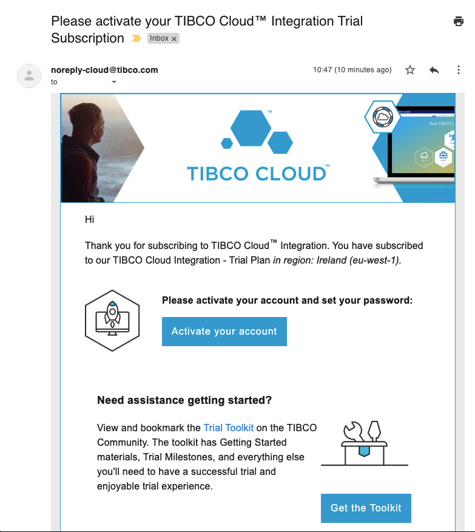
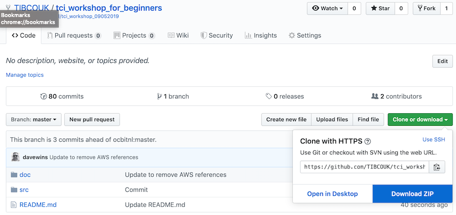

# 1. Setup Your Environment #

In this section, you'll validate your lab environment, which consists of a client machine and a TIBCO Cloud Integration trial environment.

## 1.2 Sign up to TIBCO Cloud ##
You can skip this section and move to [1.3](#1.3) if you have already signed up to a trial of TIBCO Cloud™ Integration.

### 1.2.1 Getting Ready ###

To sign up to the TIBCO Cloud [click here](https://account.cloud.tibco.com/signup/tci) and fill in the form, choosing Europe as a region). 

### 1.2.2 Respond to your activation email

Once you have submitted your sign up form, you will be sent an Activation email that you will need to use to Activate your trial subscription. If you have not received this email within 10 minutes, please check your Junk or Promotions folder!

After clicking on the link in the email - you will need to finalise your details and set up your password for your TIBCO Account.

### 1.2.3 Welcome to the TIBCO Cloud!

Once activated, you will be taken directly to the TIBCO Cloud home page, where you will be asked to complete a small form to help identify the most appropriate capabilities you will be using.

###  1.3 Sign in to the TIBCO Cloud ###

1. Browse to [https://cloud.tibco.com/](https://cloud.tibco.com/).

    
2. Click **SIGN IN** (at the right top), and fill out the relevant account details (**Email Address** and **Password**) in the following screen.

    
3. After this, you should see a landing page which looks similar to this:

    

## 1.4 Download and Install TIBCO Business Studio™ and Postman:

* [TIBCO Business Studio™ for BusinessWorks™](https://eu.integration.cloud.tibco.com/download)
* [Postman](https://www.getpostman.com/downloads/)

## 1.5 Download Github Repository:

1. Browse to [https://github.com/TIBCOUK/tci_workshop_for_beginners](https://github.com/TIBCOUK/tci_workshop_for_beginners)

2. Download zip file to your local hard drive

    

3. Extract the contents from the downloaded zipfile
    
## 1.6 What's Next ##

[Design an API and Create a Mock Application](001.md)
